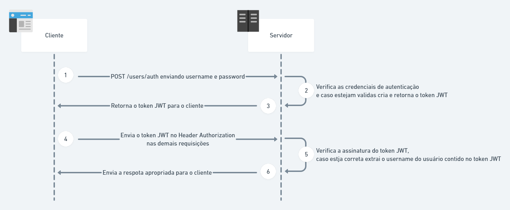

# Authorizer - Lambda Function da API Tech Challenge



Features auxiliares para a [API Tech Challenge](https://github.com/fabianogoes/fiap-tech-challenge)

- [Authorizer - Lambda Function da API Tech Challenge](#authorizer---lambda-function-da-api-tech-challenge)
  - [Features in Lambdas](#features-in-lambdas)
  - [Setup Development](#setup-development)
    - [1. Install Python3, example ubuntu:](#1-install-python3-example-ubuntu)
    - [2. Instalar virtualenv, exemple ubuntu:](#2-instalar-virtualenv-exemple-ubuntu)
    - [3. Criar um virtualenv](#3-criar-um-virtualenv)
    - [4. Ativar o virtualenv](#4-ativar-o-virtualenv)
    - [4. Instalar Dependencias](#4-instalar-dependencias)
    - [Para desativar o virtualenv](#para-desativar-o-virtualenv)
    - [Gerar o `zip` para deploy na `aws`](#gerar-o-zip-para-deploy-na-aws)
  - [Deployments](#deployments)
  - [Para criar a lambda por `awscli`](#para-criar-a-lambda-por-awscli)
  - [Para atualizar a lambda por `awscli`](#para-atualizar-a-lambda-por-awscli)


## Features in Lambdas

- [ ] Authenticator - Recebe CPF e senha do cliente e retorna um `access token`.
- [ ] Authorizer - Usada no API Gatewate para autenticar todas as rotas.

## Setup Development 

### 1. Install Python3, example ubuntu: 

```shell
sudo apt update && sudo apt install python3
```

### 2. Instalar virtualenv, exemple ubuntu:

```shell
sudo apt update && sudo apt install python3-venv
```

### 3. Criar um virtualenv

```shell
python3 -m venv .venv
```

### 4. Ativar o virtualenv

```shell
source .venv/bin/activate
```

### 4. Instalar Dependencias

```shell
pip install -r requirements.txt
```

### Para desativar o virtualenv

```shell
deactivate
```

### Gerar o `zip` para deploy na `aws`

```shell
zip -r lambda_function.zip dotenv/ jwt/ .env lambda_function.py
```

## Deployments

## Para criar a lambda por `awscli`

```shell
aws lambda create-function --function-name tech-challenge-authorizer-lambda --runtime python3.8 --region us-east-1 --role arn:aws:iam::637423526753:role/LabRole --handler lambda_function.lambda_handler --zip-file fileb://./lambda_function.zip
```

## Para atualizar a lambda por `awscli`

```shell
aws lambda update-function-code --function-name tech-challenge-authorizer-lambda --zip-file fileb://./lambda_function.zip
```